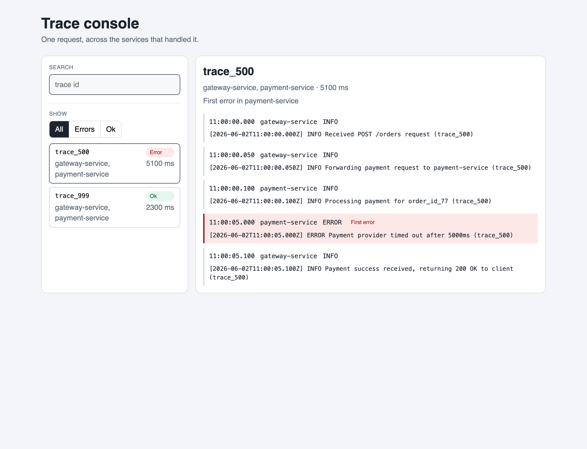

# MCP Tracing Agent

A small [Model Context Protocol](https://modelcontextprotocol.io) server. An agent (for example Cursor) calls one tool with a trace id. The server asks the trace API for that id and returns the timeline. The website shows the same summary and events.

## Why this exists

In a system with more than one service, one user action is split across several log files. Searching each file by hand is slow, and the lines are not in one place. The API keeps the events for a trace and returns them in time order. The tool gives that result back to the agent.

## How it works

```text
Cursor agent
    |
    |  tool: trace_analyzer({ traceId })
    v
MCP server (stdio)
    |
    |  GET /traces/:traceId
    v
Nest API and Postgres
```

Each log line looks like this:

```text
[2026-06-02T10:00:01.100Z] INFO Received POST /orders request (trace_999)
```

The API already sorted the events and named the first error. The tool returns that JSON. The mock log files stay in the repo for the seed and the analyzer tests. The tool does not open them.

The tool also returns a summary, not only the raw lines:

- which services took part
- how long the trace lasted, from the first event to the last
- the first `ERROR` line, or `null` when the trace has no error

## Sample

For `trace_999` the summary is: two services (`gateway-service`, `payment-service`), about 2300ms, and no error. The timeline is:

1. `gateway-service` receives `POST /orders`
2. `gateway-service` forwards the payment
3. `payment-service` starts processing the order
4. `payment-service` warns that the database is slow and retries
5. `payment-service` captures the payment
6. `gateway-service` returns `200 OK`

### Failure sample: `trace_500`

The gateway still returns `200 OK`, but the payment service times out. The summary points at that hop:

```json
{
  "traceId": "trace_500",
  "eventCount": 5,
  "services": ["gateway-service", "payment-service"],
  "startedAt": "2026-06-02T11:00:00.000Z",
  "endedAt": "2026-06-02T11:00:05.100Z",
  "durationMs": 5100,
  "firstError": {
    "service": "payment-service",
    "timestamp": "2026-06-02T11:00:05.000Z",
    "line": "[2026-06-02T11:00:05.000Z] ERROR Payment provider timed out after 5000ms (trace_500)"
  }
}
```

## Run it

Requirements: Node.js 20+.

```bash
npm install
npm test
npm run build
```

`npm test` runs the analyzer tests, the API test, and the fetch-trace tests. The analyzer checks that events are sorted by time, an unknown trace id returns no events, and `trace_500` names `payment-service` as the first error. The API test checks that same timeline through Nest. The fetch-trace tests check that the tool's client reads the JSON and reports when the API is down.

Cursor starts the server itself. In `~/.cursor/mcp.json`:

```json
{
  "mcpServers": {
    "tracing-agent": {
      "command": "node",
      "args": ["/absolute/path/to/mcp-tracing-agent/dist/index.js"],
      "env": {
        "TRACE_API_URL": "http://localhost:3000"
      }
    }
  }
}
```

`TRACE_API_URL` defaults to `http://localhost:3000`. The API and Postgres have to be running. If the API is down, the tool returns an error and the process stays up.

After `npm run build`, switch `tracing-agent` off and on in Cursor Settings, under MCP. Cursor keeps the previous Node process until you do that. The new process prints `API http://localhost:3000` on stderr. Then ask the agent to analyze `trace_999`.

The process speaks MCP on stdout. Debug lines go to stderr only, so they do not break the protocol.

## API

The NestJS API lives in `api`. It accepts events and returns the same summary the tool already builds. Events are stored in local Postgres.

```bash
docker compose up -d
npm run prisma:migrate -w @tracing/api
npm run start:dev -w @tracing/api
npm run seed -w @tracing/api
```

The server listens on port 3000. The seed reads `mock_logs` and posts every line to `POST /events`. Run it again after you add a line. Starting the server does not read the files.

- `POST /events` takes `traceId`, `service`, `level`, `message`, and `timestamp`.
- `GET /traces` lists up to 50 summaries, newest first. `?status=error` keeps traces that have an error. `?status=ok` keeps the rest.
- `GET /traces/:traceId` returns `{ summary, events }`. An unknown id returns an empty event list.

## Website

The React app lives in `web`. It reads the same API: a list of traces, and the timeline for one trace id.

```bash
npm run dev -w @tracing/web
```

Open `http://localhost:5173`. The page calls the API on port 3000.



## Tool

| Name | Input | Result |
| --- | --- | --- |
| `trace_analyzer` | `{ "traceId": "trace_999" }` | JSON with `summary` (services, duration, first error) and `events` sorted by time |

Unknown ids return an empty event list. Invalid input returns a tool error and the process keeps running.

## Stack

- Node.js, TypeScript, ESM
- `@tracing/analyzer` in `packages/analyzer`: the only sort and first-error implementation
- NestJS API with Postgres via Prisma
- React timeline in `web`
- `@modelcontextprotocol/sdk` with stdio transport
- Zod for tool arguments
